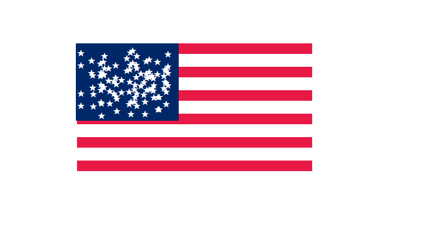

<h2>US Flag  🇺🇸 </h2>

making stars of US flag with php

<h3>Features 🔥</h3>

<h3>Goals  🎯</h3>

Using php and learning more

<h3>Tech 🚀</h3>

<h3>See Some image(s) 📸</h3>

<h3>Developer(s) ⚡ </h3>
<a href="https://www.GitHub.com/moeinfadakar">Moein Fadakar</a>

 
